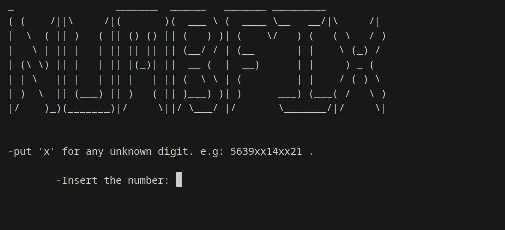

# numbFix

A wordlist generator that works with ONLY numbers. Just put 'X' for any number that you don't know.

## How it works

After runnig the program,it asks you for a number



Let's say that you know parts of the number,and you don't know the rest.for every unknown number,just put 'x'

e.g:

- 54731xx
- xx4312
- 1xx17x43

Give *NumbFix* the input, and it **generates a file wherever the tool is located** ( and names it after the input. e.g:54731xx.txt ).
In the generated text file,there are all the possible numbers,each in a separate line.
Just be careful how many 'x' you put in there,if you put too many of them,it can take a while.

It can accept inputs like 'xxxx' which basically means generating every possible 4-digit number,from 0000 to 9999 .

---

## Requirements

- A linux distribution

and that's all!

---

## How to use

1. Clone the repository

```copy
git clone https://github.com/ardavanap/numbfix.git
```

2. Give it permission to execute

```copy
sudo chmod +x numbfix
``` 

3. Run the code

You can run the program in 2 ways: 

```copy
./numbfix
```
**OR**

```copy
./numbfix 35xx12x1
```
in the above example,replace your own number. This way is a bit shorter and is suitable for
using the program in an automation script.


And if you want to compile the code yourself, just install *Golang* and compile it with:

```copy
go build numbfix.go
```

---
